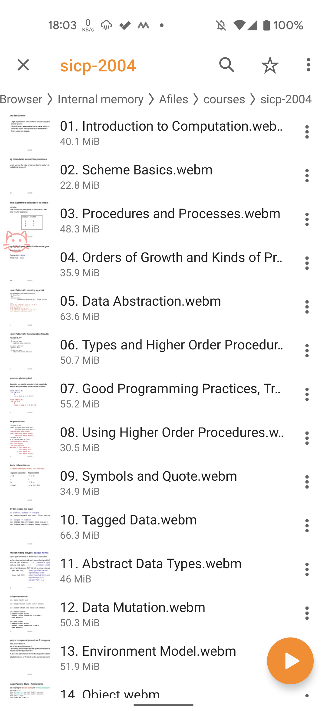

## Story

I want to batch rename some files in my Andorid device, I found a nice way is python script with `adb shell`. Tried some package, and the [pure-python-adb](https://github.com/Swind/pure-python-adb) do not need any other set-ups, as long as your `adb devices -l` works.

But, unfortunately, you have to "handle text streams".. so there some dirty code.

